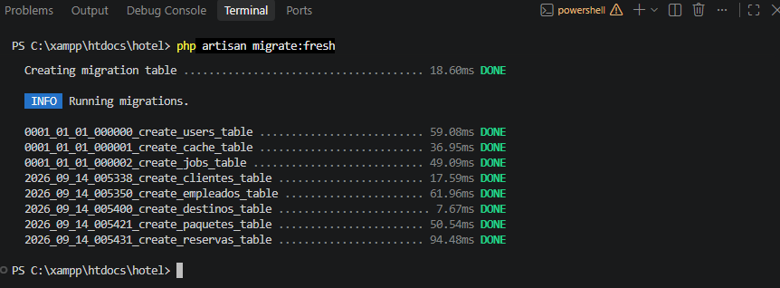
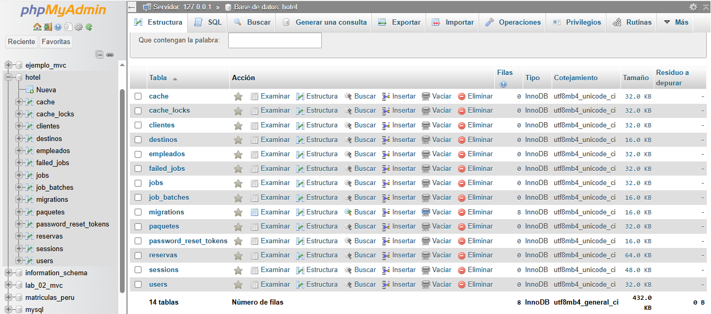
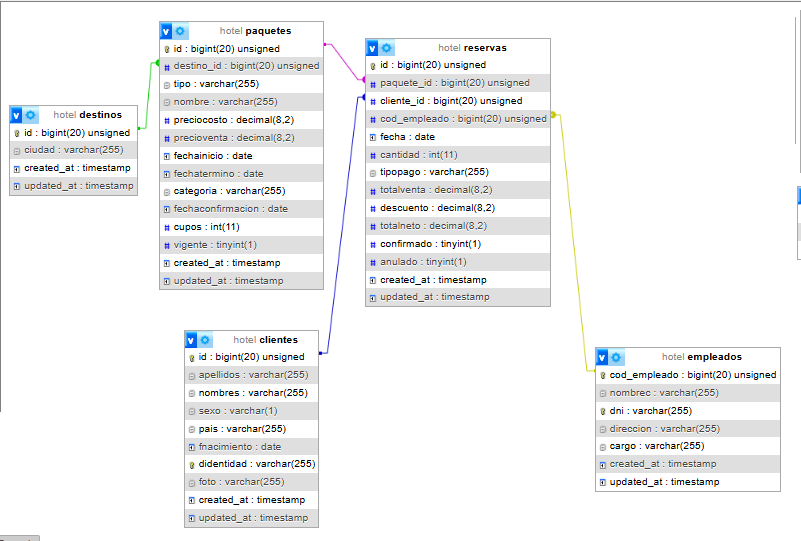
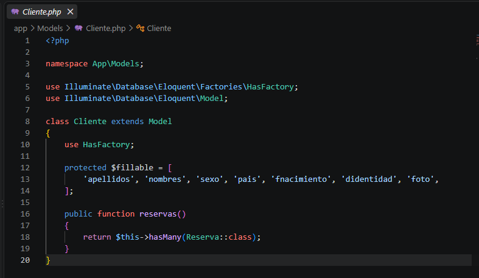
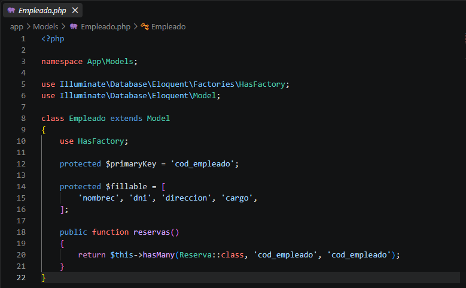
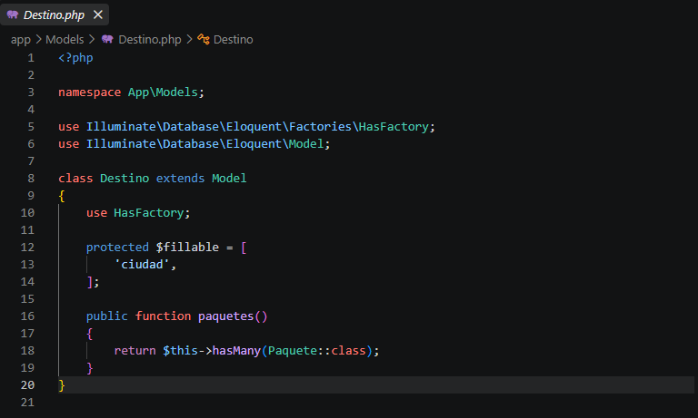
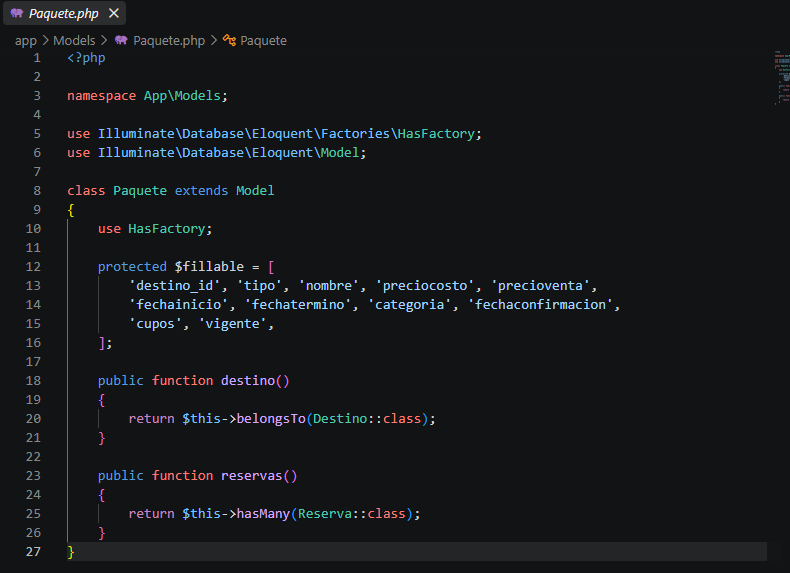
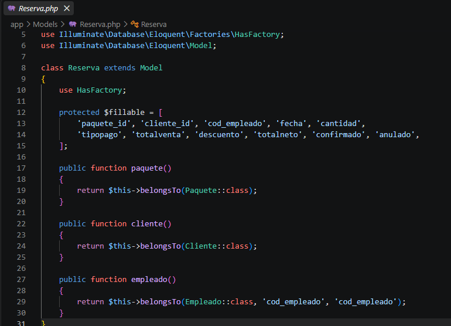

# INSTITUTO DE EDUCACIÓN SUPERIOR TECNOLÓGICO PÚBLICO
## "PEDRO P. DÍAZ"

### LABORATORIO N.° 04
#### Migraciones y Modelos en Laravel — Sistema de Reservas de un Hotel

| | |
|---|---|
| **Carrera profesional** | Desarrollo de Sistemas de Información |
| **Módulo formativo** | Programación de Sistemas de Información |
| **Unidad didáctica** | Desarrollo Web Integrado |
| **Estudiante** | Juan José Condori Bolívar |
| **Semestre** | IV |
| **Año académico** | 2026 |

---

## 1. Objetivos

- Utilizar migraciones para implementar tablas en la base de datos a partir de un modelo lógico dado.
- Implementar modelos en Laravel (Eloquent) para definir el acceso a datos y las relaciones entre tablas.
- Determinar los tipos de dato correspondientes a cada columna del modelo lógico de un sistema de reservas de hotel.
- Identificar y establecer los tipos de relación (uno a muchos) entre las tablas del modelo, tanto a nivel de base de datos (claves foráneas) como a nivel de modelos Eloquent (`hasMany` / `belongsTo`).

---

## 2. Temas tratados

Migraciones en Laravel, configuración de la conexión al gestor de base de datos, comandos Artisan, creación y estructura de las migraciones, implementación de modelos en Laravel, estructura de un modelo, definición de relaciones entre modelos.

---

## 3. Marco teórico

**Migraciones:** definen la creación de tablas y su modificación, llevando un registro de cada uno de los cambios producidos en el esquema de la base de datos. Son archivos ubicados en `database/migrations`, cuyo nombre incluye una marca de tiempo que permite a Laravel determinar el orden de ejecución.

**Modelos (Eloquent ORM):** un modelo es una clase que representa una tabla con todas las funcionalidades necesarias para crear, consultar, actualizar y borrar registros de dicha tabla en una base de datos relacional, siguiendo el patrón Active Record. Por convención, el nombre de un modelo se escribe en singular (a diferencia del nombre de la tabla, en plural), y por defecto Eloquent busca la llave primaria en el campo `id`.

Entre los atributos personalizables de un modelo destacan: `$table` (nombre de la tabla asociada), `$fillable` (campos que se pueden asignar masivamente), `$primaryKey` (nombre de la columna de llave primaria, cuando no es `id`).

---

## 4. Modelo lógico del sistema de reservas

El sistema de reservas de un hotel incluye paquetes y ciudades (destinos) que son atendidos por un empleado y reservados por los clientes. El modelo lógico está compuesto por 5 entidades:

- **Cliente** — datos personales de quien realiza la reserva.
- **Empleado** — quien genera y gestiona la reserva.
- **Destino** — ciudad a la que pertenece un paquete turístico.
- **Paquete** — oferta turística asociada a un destino.
- **Reserva** — entidad central que vincula a un cliente, un empleado y un paquete.

### 4.1 Relaciones identificadas

| Relación | Tablas | Tipo |
|---|---|---|
| Realiza | Cliente → Reserva | 1 a N (un cliente realiza varias reservas) |
| Genera | Empleado → Reserva | 1 a N (un empleado gestiona varias reservas) |
| Incluye | Paquete → Reserva | 1 a N (un paquete aparece en varias reservas) |
| Tiene | Destino → Paquete | 1 a N (un destino tiene varios paquetes) |

Las claves foráneas se ubican siempre en la tabla del lado "muchos" de cada relación: **Reserva** concentra tres FK (`cliente_id`, `cod_empleado`, `paquete_id`), y **Paquete** contiene una FK (`destino_id`) hacia Destino. Cliente, Empleado y Destino no contienen ninguna clave foránea, al ser el lado "1" en todas sus relaciones.

### 4.2 Tipos de dato determinados por columna

| Tabla | Campo | Tipo Laravel |
|---|---|---|
| **Cliente** | IdCliente | `id()` |
| | Apellidos, Nombres, Pais, DIdentidad | `string()` |
| | Sexo | `string(1)` |
| | Fnacimiento | `date()` nullable |
| | Foto | `string()` nullable |
| **Empleado** | CodEmpleado | `id('cod_empleado')` |
| | NombreC, Dni, Cargo | `string()` |
| | Direccion | `string()` nullable |
| **Destino** | IdDestino | `id()` |
| | Ciudad | `string()` |
| **Paquete** | IdPaquete | `id()` |
| | IdDestino | `foreignId()` → Destino |
| | Tipo, Nombre | `string()` |
| | Categoria | `string()` nullable |
| | PrecioCosto, PrecioVenta | `decimal(8,2)` |
| | FechaInicio, FechaTermino, FechaConfirmacion | `date()` nullable |
| | Cupos | `integer()` |
| | Vigente | `boolean()` |
| **Reserva** | IdReserva | `id()` |
| | IdPaquete, IdCliente, CodEmpleado | `foreignId()` / `unsignedBigInteger()` |
| | Fecha | `date()` |
| | Cantidad | `integer()` |
| | TipoPago | `string()` |
| | TotalVenta, Descuento, TotalNeto | `decimal(8,2)` |
| | Confirmado, Anulado | `boolean()` |

---

## 5. Estructura final del proyecto

```
hotel/
├── app/
│   └── Models/
│       ├── Cliente.php
│       ├── Empleado.php
│       ├── Destino.php
│       ├── Paquete.php
│       └── Reserva.php
├── database/
│   └── migrations/
│       ├── 0001_01_01_000000_create_users_table.php
│       ├── 0001_01_01_000001_create_cache_table.php
│       ├── 0001_01_01_000002_create_jobs_table.php
│       ├── 2026_09_14_005338_create_clientes_table.php
│       ├── 2026_09_14_005350_create_empleados_table.php
│       ├── 2026_09_14_005400_create_destinos_table.php
│       ├── 2026_09_14_005421_create_paquetes_table.php
│       └── 2026_09_14_005431_create_reservas_table.php
├── routes/
│   └── web.php
├── .env
└── ...
```

---

## 6. Proceso de desarrollo

### 6.1 Creación del proyecto

Se creó el proyecto Laravel desde la terminal, dentro del directorio de XAMPP (`C:\xampp\htdocs`):

```bash
cd C:\xampp\htdocs
composer create-project laravel/laravel hotel
```

Y se abrió el proyecto en Visual Studio Code:

```bash
cd hotel
code .
```

### 6.2 Creación de la base de datos

Se creó la base de datos **hotel** mediante el administrador phpMyAdmin (http://localhost/phpmyadmin), con Apache y MySQL iniciados desde el panel de control de XAMPP.

### 6.3 Configuración de la conexión en `.env`

Por defecto, el proyecto se generó con `DB_CONNECTION=sqlite` y las líneas de configuración de MySQL comentadas. Se editó el archivo `.env` para apuntar a la base de datos creada en XAMPP:

```
DB_CONNECTION=mysql
DB_HOST=127.0.0.1
DB_PORT=3306
DB_DATABASE=hotel
DB_USERNAME=root
DB_PASSWORD=
```

Tras el cambio, se limpió la caché de configuración para que Laravel tomara los nuevos valores:

```bash
php artisan config:clear
```

### 6.4 Creación de modelos y migraciones

Se generaron los 5 modelos junto con su migración correspondiente (opción `-m`), respetando el **orden de dependencias**: primero las entidades sin clave foránea (Cliente, Empleado, Destino), y al final las que dependen de ellas (Paquete, que depende de Destino; y Reserva, que depende de Cliente, Empleado y Paquete):

```bash
php artisan make:model Cliente -m
php artisan make:model Empleado -m
php artisan make:model Destino -m
php artisan make:model Paquete -m
php artisan make:model Reserva -m
```

### 6.5 Definición de columnas en las migraciones

Cada migración se editó en su método `up()`, definiendo las columnas según la tabla de tipos de dato de la sección 4.2. Por ejemplo, la migración de la tabla `reservas` (la de mayor complejidad, al concentrar las 3 claves foráneas):

```php
public function up(): void
{
    Schema::create('reservas', function (Blueprint $table) {
        $table->id();
        $table->foreignId('paquete_id')->constrained('paquetes')->onDelete('cascade');
        $table->foreignId('cliente_id')->constrained('clientes')->onDelete('cascade');
        $table->unsignedBigInteger('cod_empleado');
        $table->foreign('cod_empleado')->references('cod_empleado')->on('empleados')->onDelete('cascade');
        $table->date('fecha');
        $table->integer('cantidad');
        $table->string('tipopago');
        $table->decimal('totalventa', 8, 2);
        $table->decimal('descuento', 8, 2)->default(0);
        $table->decimal('totalneto', 8, 2);
        $table->boolean('confirmado')->default(false);
        $table->boolean('anulado')->default(false);
        $table->timestamps();
    });
}
```

### 6.6 Ejecución de migraciones y resolución de un error de clave foránea

Al ejecutar `php artisan migrate`, la migración de `reservas` falló con el error *"Foreign key constraint is incorrectly formed"*. La causa: la tabla `empleados` fue definida con clave primaria `cod_empleado` (en lugar del `id` por defecto), mientras que la migración de `reservas` intentaba crear la relación con `foreignId('cod_empleado')->constrained('empleados')`, método que por defecto asume que la tabla referenciada usa `id` como llave primaria.

La corrección consistió en declarar la columna y la restricción de forma explícita, indicando la columna real referenciada:

```php
$table->unsignedBigInteger('cod_empleado');
$table->foreign('cod_empleado')->references('cod_empleado')->on('empleados')->onDelete('cascade');
```

Debido a que el primer intento fallido dejó la tabla `reservas` creada a medias, se utilizó el comando `migrate:fresh` para reiniciar todas las tablas desde cero y volver a ejecutar el conjunto completo de migraciones en el orden correcto:

```bash
php artisan migrate:fresh
```

Con este comando, las 5 tablas propias del modelo (además de las 4 predeterminadas de Laravel: `users`, `cache`, `jobs`, y sus relacionadas) se crearon correctamente, sin errores.

### 6.7 Definición de relaciones en los modelos Eloquent

Con las tablas ya creadas, se definieron las relaciones correspondientes en cada modelo, usando `hasMany()` en el lado "1" de cada relación y `belongsTo()` en el lado "muchos". Por tratarse de una llave primaria no estándar, el modelo `Empleado` requirió declarar explícitamente `$primaryKey`:

```php
class Empleado extends Model
{
    use HasFactory;

    protected $primaryKey = 'cod_empleado';

    protected $fillable = ['nombrec', 'dni', 'direccion', 'cargo'];

    public function reservas()
    {
        return $this->hasMany(Reserva::class, 'cod_empleado', 'cod_empleado');
    }
}
```

El modelo `Reserva`, al estar vinculado a las otras cuatro entidades, define las tres relaciones inversas correspondientes:

```php
class Reserva extends Model
{
    use HasFactory;

    protected $fillable = [
        'paquete_id', 'cliente_id', 'cod_empleado', 'fecha', 'cantidad',
        'tipopago', 'totalventa', 'descuento', 'totalneto', 'confirmado', 'anulado',
    ];

    public function paquete()
    {
        return $this->belongsTo(Paquete::class);
    }

    public function cliente()
    {
        return $this->belongsTo(Cliente::class);
    }

    public function empleado()
    {
        return $this->belongsTo(Empleado::class, 'cod_empleado', 'cod_empleado');
    }
}
```

### 6.8 Verificación final

Se verificó en phpMyAdmin que las 5 tablas del modelo (`clientes`, `empleados`, `destinos`, `paquetes`, `reservas`) se crearon con sus columnas, tipos de dato y restricciones de clave foránea correctas, reflejando fielmente el modelo lógico entregado en la tarea.

---

## 7. Funcionamiento de la aplicación

### 7.1 Migraciones ejecutadas correctamente

<!-- INSERTAR CAPTURA: terminal con el resultado de php artisan migrate:fresh, todas las migraciones en DONE -->


### 7.2 Tablas creadas en phpMyAdmin

<!-- INSERTAR CAPTURA: listado de las 5 tablas del modelo dentro de la base de datos "hotel" -->


### 7.3 Estructura y relaciones de la tabla `reservas`

<!-- INSERTAR CAPTURA: estructura de la tabla reservas mostrando las 3 claves foráneas -->


### 7.4 Modelos con sus relaciones Eloquent

**Modelo `Cliente`**


**Modelo `Empleado`**


**Modelo `Destino`**


**Modelo `Paquete`**


**Modelo `Reserva`**


---

## 8. Conclusiones

- Respetar el **orden de dependencias** al crear las migraciones (primero las tablas sin clave foránea, luego las que dependen de ellas) es indispensable para que `php artisan migrate` se ejecute sin errores de restricción.
- Cuando una tabla utiliza una llave primaria distinta al estándar `id` (como `cod_empleado` en la tabla Empleado), tanto la migración como el modelo deben declararlo explícitamente (`foreign()->references()` y `$primaryKey`), ya que los métodos abreviados de Laravel (`foreignId()->constrained()`) asumen `id` por defecto.
- El comando `migrate:fresh` resulta la forma más segura de recuperarse de una migración fallida a medio ejecutar, evitando conflictos de tablas parcialmente creadas.
- Definir las relaciones `hasMany()` / `belongsTo()` en los modelos Eloquent, en espejo de las claves foráneas de las migraciones, permite luego navegar entre entidades relacionadas (por ejemplo, obtener todas las reservas de un cliente) sin necesidad de escribir consultas SQL manuales.
- Separar el diseño lógico (tipos de dato y relaciones) del proceso de implementación en Laravel facilitó detectar con precisión el origen del error de clave foránea, en lugar de modificar migraciones al azar.

---

## 9. Repositorio

Código fuente completo disponible en este repositorio de GitHub.
